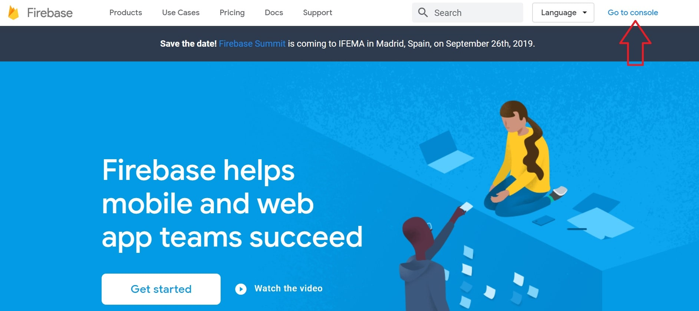
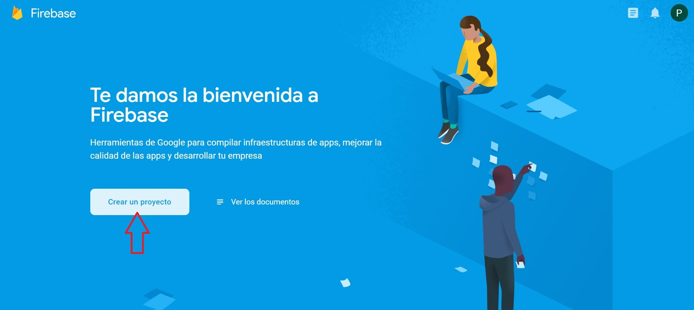
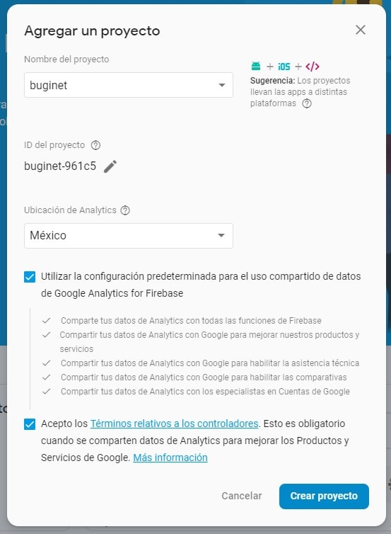
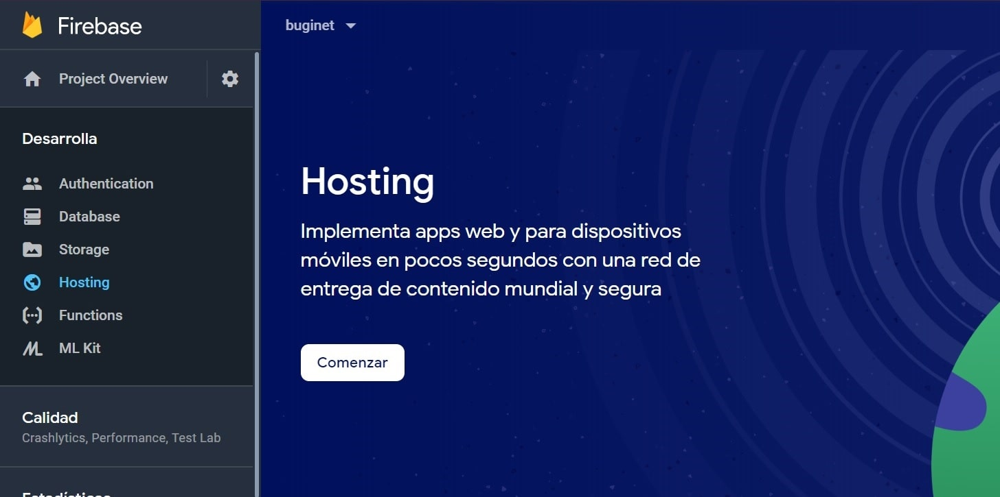
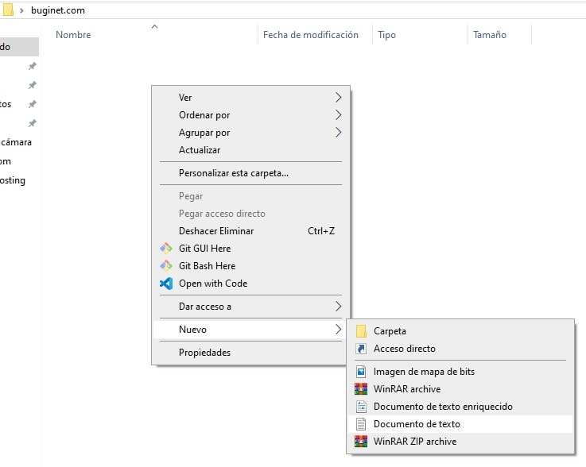

<div class="alert alert-warning">
    <div class="alert-icon">
        ⚠️
    </div>
    <div class="alert-text">
        <p>Es necesario tener instalado NodeJs en nuestra computadora y junto a ello Node package manager o npm.
    </div>
</div>

## ¿Qué es Firebase?

> Firebase ayuda a los equipos de aplicaciones móviles y web a tener éxito 🙌

Firebase es un conjunto de herramientas que nos facilita el desarrollo de aplicaciones web y móviles, una de sus herramientas más destacadas es la base de datos en tiempo real y auto escalable llamada <a href="https://firebase.google.com/docs/firestore/" target="_blank">Firestore</a>, esta base de datos en la nube nos provee una solución inmediata con cero configuración de servidores, etc. Lista para ser utilizada por nuestras aplicaciones, basta con unos cuantos clics por aquí y por allá para tener todo listo 🤯.

## Firebase Hosting

La misión de Firebase es simple: Ayudar a los desarrolladores a tener éxito. Por esto también nos ofrecen una manera muy fácil y rápida de hostear o alojar nuestros sitios web y esta herramienta se conoce como <a href="https://firebase.google.com/docs/hosting/" target="_blank">Firebase Hosting</a>.

Firebase Hosting nos provee un servidor de grado de producción listo para ser utilizado, que bastará ejecutar un comando para subir nuestro sitio de una manera segura, rápida, y además viene con un certificado https integrado para que nuestros sitios sean aún más seguros.

## Registrándonos a Firebase

Para empezar a usar la herramientas de Firebase es necesario que te registres en: <a href="https://firebase.google.com/" target="_blank">firebase.google.com/</a>

### Registro con Google

Sigue todo los pasos de registro, si ya tienes una cuenta de Gmail el proceso es aún más rápido de lo contrario primero tendrás que crearte una cuenta de Gmail en: <a href="https://accounts.google.com/signup/v2" target="_blank">accounts.google.com/signup/v2</a>

### Ir a la consola

una vez te hayas registrado con tu cuenta de Google o Gmail debes ir a la consola:



Después nos dirigimos a crear un proyecto:



Creamos el proyecto:



Una vez se cree el proyecto nos dirigimos a Visión general del Proyecto y el menú lateral izquierdo nos vamos a Desarrolla > Hosting



## Instalando Firebase Tools

Cuando le damos en comenzar nos aparece una ventana en donde nos pide que instalemos el paquete de Firebase Tools mediante NPM aquí empezaremos a usar la consola y ejecutaremos el comando de npm:

abrimos una consola o terminal y escribimos lo siguiente:

<div class="filename">
    <i class="fas fa-terminal"></i> Terminal
</div>
<div class="highlight">
    <pre class="chroma">npm install -g firebase-tools</pre>
</div>

Recuerda que si estas en Mac OS tienes que usar el signo \$ para dar permisos de administrador y si estas en Windows y te da errores de permiso trata de abrir la consola como administrador.

Una vez termine el proceso de instalación tenemos que iniciar Firebase para esto antes vamos a crearnos una página web muy sencilla para este ejemplo y esta página web es la que vamos a subir al hosting, si tu ya tienes otra página web que te gustaría subir adelante te puedes saltar esta parte.

### Creando nuestro sitio

Creemos un directorio en donde se encontraran todos los archivos de nuestra página web en mi caso será <strong>buginet.com</strong> dentro de:

C:\Users\pedro\Desktop\buginet.com

y dentro de este directorio o carpeta creare un nuevo documento de texto:



una vez creado el archivo le damos doble clic para abrir y escribimos lo siguiente:

<div class="filename">
    <i class="fas fa-code warning"></i> index.html
</div>
<pre></pre>
```html
<html>
<head>
    <title>Buginet</title>
</head>
    <body>
        <h1>Bienvenidos a buginet.com 👋</h1>
    </body>
</html>
```

siguiente le damos en Archivo > Guardar Como y le ponemos como nombre index.html Ojo: es muy importante que le cambies la extension de .txt a .html:



Es posible que nos aparezca un mensaje de confirmación le damos que si estamos seguros, esto nos creara un archivo HTML muy básico que podemos subir a Firebase, si queremos estar seguro que esta todo Ok podemos abrir el archivo index.html que acabamos de crear este se debería abrir en nuestro navegador y veremos el mensaje que le pusimos.

Listo tienes tu primer página web!😁

Después de esto abrimos nuevamente nuestra terminal y nos dirigimos a nuestra carpeta en donde tenemos nuestra página web en mi caso esta en:

C:\Users\pedro\Desktop\buginet.com

cuando estemos ahí continuamos...

### Firebase Login

Ya que tenemos algo para subir a Firebase Hosting y tenemos las herramienta de Firebase Tools instaladas procedemos a iniciar sesión con Firebase para esto ejecutamos lo siguiente:

<div class="filename">
    <i class="fas fa-terminal"></i> Terminal
</div>

    firebase login


nos preguntara si queremos enviar información anónima de uso, en mi caso pondré que si ya que esto les ayuda a mejorar su producto basta con poner y ó n:



una vez hayas completado esto nos abrirá una página en donde se nos pedirá que nos identifiquemos con nuestra cuenta de Google si ya estas identificado se no pedirá que demos permisos a Firebase le damos en "Permitir" para continuar.

Si todo es correcto deberíamos de ver esto:



y en la consola debemos ver un mensaje de que todo fue correcto.

### Firebase Init

Ahora que estamos logeados con nuestra cuenta de firebase debemos inicializar el directorio de nuestra página como un proyecto de Firebase para esto ejecutamos el siguiente comando:

<div class="filename">
    <i class="fas fa-terminal"></i> Terminal
</div>

    firebase init


y nos manda lo siguiente:



le damos 'y' para continuar.

Ahora nos preguntará que herramienta deseamos utilizar con este proyecto y en nuestro caso queremos usar <strong>Hosting</strong> entonces navegamos con las teclas de arriba y abajo y nos posicionamos en la opción de Hosting y presionamos la tecla 'Espacio' para seleccionar este debería poner un asterisco de seleccionado y ahora presionamos la tecla 'Enter' para continuar.



Si todo es correcto nos va a pedir que asociemos un proyecto y como ya hemos creado el proyecto anteriormente le vamos a asociar ese mismo presionando 'Enter' en la opción:



Ahora nos pregunta que directorio queremos usar para desplegar nuestra página y nos sugiere (public) así lo dejaremos solo damos 'Enter' seguido de esto nos pregunta si queremos reescribir nuestras rutas a index.html este paso no es necesario en nuestro caso ya que no tenemos un SPA o Single Page Application entonces seleccionamos que no escribiendo 'n' y damos 'Enter' nos debería de aparecer que todo fue correcto:



Si revisamos nuestro directorio deberíamos de ver varios archivos de firebase y una nueva carpeta llamada public en ella hay dos archivos HTML uno es index.html y el otro es 404.html ahora podemos borrar dentro de public ese archivo index.html y poner el nuestro copiándolo ahí o podemos copiar nuestro index.html y pegarlo en public reescribiendo el que esta actualmente.



## Firebase Deploy

Ya casi terminamos solo queda una cosa por hacer y es subir nuestro directorio public a Firebase Hosting esto es muy fácil de hacer basta con ejecutar el siguiente comando dentro de nuestra carpeta raíz en mi caso:

C:\Users\pedro\Desktop\buginet.com

<div class="filename">
    <i class="fas fa-terminal"></i> Terminal
</div>

    firebase deploy




Listo 🚀 ahora solo dirígete a la ruta que te proporciona en automático Hosting URL de firebase y deberás ver tu página



Felicidades 🎉 ya tienes tu primer sitio web en internet, ya solo falta que le agregues contenido interesante para que todos puedan ver lo que haces.
